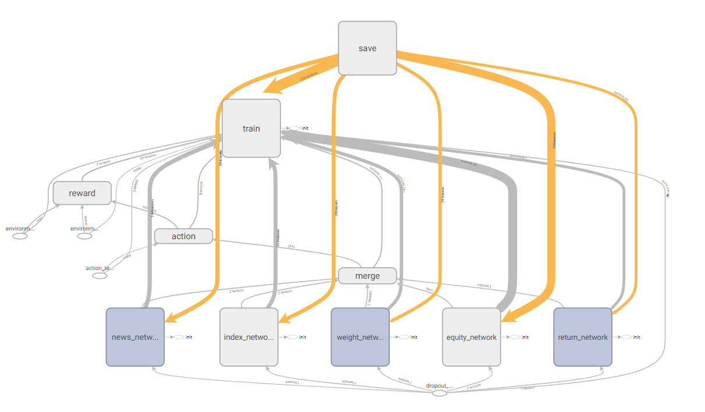

# Applying Reinforcement Learning in Finance Market Trading

--- 
## Overview      

---   
 
 This is the source code of my graduate thesis.
 My thesis focuses on applying reinforcement learning in finance market trading. 
 Training an agent, let it perceive the market state and generate trading decisions automatically.
 Currently, there are two versions of models, one is for single security dual direction (long, short) trading,
 the other is for one direction (long) portfolio management. The first version can also be used for pairs trading or hedge trading,
 treating the spread of the price of two assets as a security.  
 

## Model  

---   
  The model was originally from [1], improved with some ideas from [2] and [3]. However, during the backtest, 
  I found that it is still difficult to model the interaction of agent and market environment correctly, especially in a live trading scenario.   
  
  
  

## Experiment

---  

The experiment code of two versions of the model are in the notebook respectively. Please see .ipyb files for any details. 

## Reference

[1] Deep Direct Reinforcement Learning for Financial Signal Representation and Trading [IEEE 2016]  
[2] Training A Neural Network With A Financial Criterion Rather Than A Prediction Criterion [International Journal of Neural Systems 1997]  
[3] A Deep Reinforcement Learning Framework for the Financial Portfolio Management Problem 