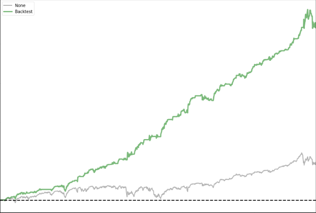
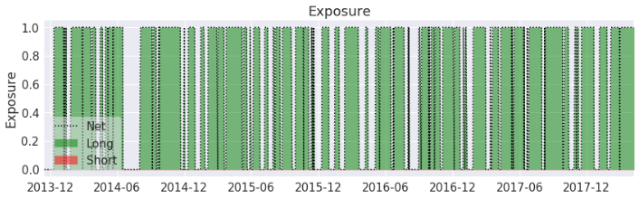
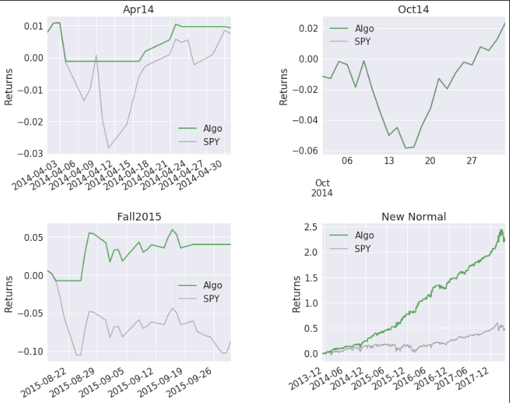

# Applying Reinforcement Learning in Quantitative Trading

This project seeks to create and analyze a Reinforcement Learning (RL) model and its effectiveness in quantitatively trading on several different asset classes. Assets analyzed in this project include:

- CryptoCurrency (Huobi)
- End of day US Stock prices
- and Continuos Futures

Several [experiments](#experiments) were performed to evaluate the effectiveness of this model on these different assets, as well as the market conditions affecting the model. 

Additionally, if you find yourself confused/lost/needing more information, tutorial files [```history\PairsTradingTutorial.ipynb```](./history/PairsTradingTutorial.ipynb) and [```history\PortfolioTutorial.ipynb```](./history/PortfolioTutorial.ipynb) will assist in understanding the basics of the Pairs Trading and Portfolio Management logic used in this project.

## Table of Contents

1. [Overview](#overview)
2. [Experiments](#experiments)
3. [Backtesting](#backtesting)
4. [References](#references)

## Overview  

This is the repository of my graduate thesis which aims to use reinforcement learning in quantitative trading.
Two types of RL models were experimented and could make good performance in the back-test:
1. **Policy Gradient**
    - Vanilla Policy Gradient (not implemented in this repo)
    - Multi-Task Recurrent Policy Gradient (RPG)
2. **Direct RL**
    - Vanilla DRL (DRL)
    - A hybrid network involves news embedding vectors (DRL with news)
    - This model relies on several input features:
        - **f**:  shape=(batch_size, feature_number), take any information you need and make a matrix in n rows and m columns 
            - n is the timestep for a batch
            - m is the number of features. 
            - Recommend to use technical indicators (MACD,RSI...) of assets you want to manage.
        - **z**:  return of rate vector with n elements
        - **c**:  transaction cost

    - And calculates output based on these formulas:
        - **d_t** = g(f,d_t-1...d_t-n) 
            - d_t is the **action**, represent the predict portfolio weight generated by
            - g is the complex non-linear transformation procedure, here we use GRU-rnn current information and previous several actions
        - **r_t** = d_t-1 * log(z_t) - c * |d_t-d_t-1|
            - r_t is the **return of current time step**, which is calculated by using the log of the return of rate of assets price in current step with previous predict action d_t - 1. Then, subtract transaction cost if the weight of holding assets changes.
        - **R** = \sum_t(r_t)
            - The total log return
    - With the objective:
        - **object**: max(R|theta)
        - The objective is to maximize the total return.

## Experiments

```.ipynb``` files are the details and results of experiments.

This repository contains 3 types of environments:  
1. CryptoCurrency (Huobi): [```env/crc_env.py```](./env/crc_env.py)  
2. End of day US stock prices (quandl): [```env/stock_env.py```](env/stock_env.py)  
3. Continuous Futures (quandl): [```env/futures_env.py```](env/futures_env.py)  

And, 2 types of agents:  
1. DRL: [```agents/drl_agent.py```](agents/drl_agent.py) and [```agents/drl_news_agent.py```](agents/drl_news_agent.py)  
2. RPG: [```agents/rpg_agent.py```](agents/rpg_agent.py) and [```agents/rpg_news_agent.py```](agents/rpg_news_agent.py)  

### Result Discussion

- **Simple Tear Sheet:** Provides an overview of the strategy's performance compared to a benchmark, a buy-and-hold strategy. It includes metrics such as cumulative returns, annualized return, Sharpe ratio, maximum drawdown, and various risk-adjusted performance measures.
    - Example Output: Cummulative Returns  
    

- **Position Tear Sheet:** Provides insights into the strategy's position allocations over time. It shows the distribution of capital across different assets or instruments in the portfolio.
    - Example Output: Exposure  
    

- **Interesting Times Tear Sheet:** Identifies periods of interest or anomalies in the strategy's performance. It highlights specific time periods where the strategy experienced significant gains or losses compared to the benchmark.
    - Example output:  
    

Also, there are some history codes in ```history``` and ```model_archive``` which have been deprecated, but contains some early ideas, please feel free to use them.

## Backtesting

Utilizes the Zipline library for simulating trading environments and implements a pairs trading algorithm.

### Pairs Trading Backtesting

#### Basic Usage:  
To use this script, ensure that necessary dependencies are installed and the custom modules (DRL_PairsTrading, TensorBoard) are accessible. Adjust parameters such as **asset symbols**, **date ranges**, and **trading frequencies** as per requirements before executing the script. 

#### Components

1. **Data Preprocessing:** The ```generate_tech_data``` function prepares technical indicators such as ```Momentum (MOM)```, ```Moving Average Convergence Divergence (MACD)```, ```Relative Strength Index (RSI)```, and ```Chande Momentum Oscillator (CMO)``` for the given pair of assets.

2. **Normalization:** The batch_nomorlize function performs batch normalization on the prepared data to standardize it for training.

3. **Model Initialization:** An instance of the DRL_PairsTrading model is created, which presumably encapsulates the RL-based pairs trading strategy.

4. **Initialization**: The initialize function sets up initial parameters and context for the trading algorithm, including defining assets, fees, commissions, slippage, and tensorboard logging.

5. **Before Trading Start:** The before_trading_start function is executed before each trading day to fetch historical data, generate technical features, and train the RL model until a certain cumulative reward threshold is reached.

6. **Trading Logic:** The handle_data function is called for each bar of data and executes trading actions based on the model predictions. It records asset prices, spread, and actions taken, and submits orders to maintain desired positions based on predicted signals.

7. **Main Execution:** The if **'name' == 'main':** block initializes the backtesting environment using the zipline.run_algorithm function within specified date ranges, data frequency, and capital base, and saves the results to a pickle file.

### Portfolio Backtesting

#### Basic Usage:
To use this script, ensure that necessary dependencies are installed and any custom modules or classes required for the portfolio management strategy are accessible. Adjust parameters such as asset symbols, date ranges, bootstrap sequence length, target profit multiplier, and data bundle as per requirements before executing the script.

#### Components:
1. **Imports and Setup:** The script begins by importing necessary libraries including logbook, numpy, pandas, quandl, requests, talib, zipline, and custom modules or classes required for portfolio management such as DRL_Portfolio and TensorBoard. It also sets up logging configurations for Zipline.

2. **Initialization:** The initialize function sets up initial parameters and context for the portfolio management algorithm. This includes defining assets, fees, commissions, slippage, bootstrap sequence length, tensorboard logging directory, target profit multiplier, and loading historical data.

3. **Before Trading Start:** The ```before_trading_start function``` is executed before each trading day to perform any necessary calculations or data preprocessing steps required for portfolio rebalancing. It generates technical features for each asset and index data, normalizes the features, and initializes the RL model.

4. **Trading Logic:** The script implements a trading logic within the ```handle_data``` function, which is called for each bar of data. It executes trading actions based on the output of the RL model, rebalancing the portfolio according to predicted actions.

5. **Logging and Monitoring:** The script logs relevant information such as portfolio performance metrics, predicted rewards, S&P 500 index value, and index return.

6. **Main Execution:** The if **'name' == 'main':** block initializes the backtesting environment using the ```zipline.run_algorithm``` function within specified date ranges, data frequency, and capital base. It executes the portfolio management strategy and saves the results to a pickle file.

#### Alpha Backtest

The alpha strategy backtest implements a portfolio management strategy based on alpha signals generated from various quantitative models or factors. The objective is to exploit perceived mispricings or inefficiencies in the market to achieve superior returns compared to a benchmark index.

#### News Backtest

The news-based strategy backtest implements a portfolio management approach that incorporates sentiment analysis and news sentiment signals to guide investment decisions. It aims to exploit information from news articles or sources to anticipate market movements and adjust portfolio allocations accordingly.

#### Alpha + News Backtest

The alpha + news-based strategy backtest combines traditional alpha signals with sentiment analysis derived from news articles or sources to guide investment decisions. It aims to leverage both quantitative factors and qualitative information to generate alpha and optimize portfolio performance.


## References

[1] [Deep Direct Reinforcement Learning for Financial Signal Representation and Trading](http://ieeexplore.ieee.org/document/7407387/)  
[2] [Using a Financial Training Criterion Rather than a Prediction Criterion](http://www.worldscientific.com/doi/abs/10.1142/S0129065797000422)  
[3] [A Deep Reinforcement Learning Framework for the Financial Portfolio Management Problem](http://arxiv.org/abs/1706.10059)  
[4] [Recurrent Reinforcement Learning: A Hybrid Approach](http://arxiv.org/abs/1509.03044)  
[5] [Reinforcement Learning for Trading](http://dl.acm.org/citation.cfm?id=340534.340841)  
[6] [Continuous control with deep reinforcement learning](http://arxiv.org/abs/1509.02971)  
[7] [Memory-based control with recurrent neural networks](https://arxiv.org/abs/1512.04455)  
